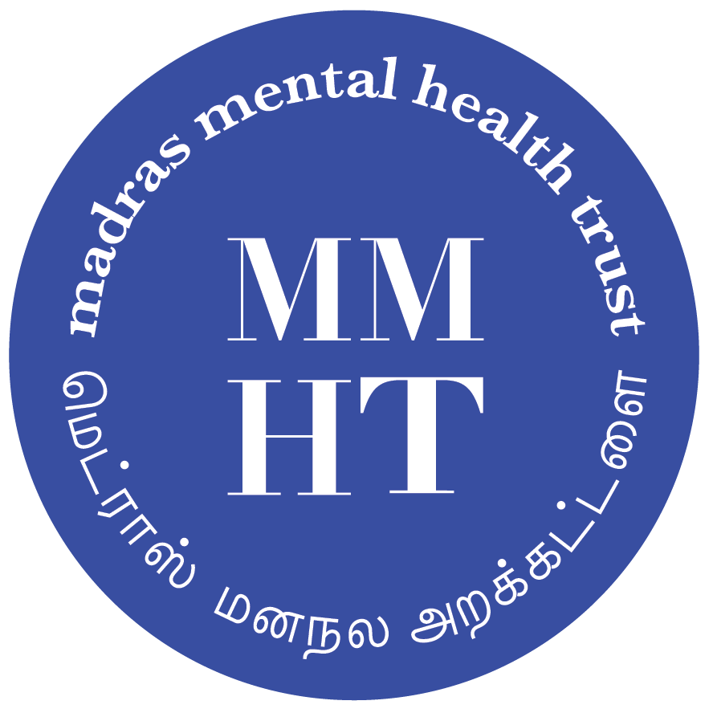

மெட்ராஸ் மனநல அறக்கட்டளை தமிழ்நாட்டில் சென்னையைத் தலைமையிடமாகக் கொண்டு மனநலப் பேணலும்குடி,
போதைப்பொருள் வயமை நீக்கமும் உளவியல்வழிப்பண்டுவச் சேவையும் வழங்கிவரும் மனநல மையமாகும்.

இச்சேவையைப் பயன்படுத்திக் கொள்ள விரும்புகிறீர்கள் என்றால் [சேவைத் தகவல்](service.html)
பகுதியைப் பார்க்கவும்.

### தொலைநோக்கு

மனநலப் பேணலை மேலும் பரவலாகக் கிடைக்கக்கூடியதாகச் செய்வதும் பற்றாக்குறை இடைவெளியை அகற்றுவதும்

### மேற்கொள் பணி

வளம்குறைந்த பின்னணியைச் சேர்ந்தவர்களுக்கு அகல்விரிவான, செலவு தாங்கக்கூடிய, எளிதில்
அணுகக்கூடிய மருத்துவப்பேணலை வழங்கும் மனநலப்பண்டுவ நிலையம் ஒன்றை நிறுவி நடத்துவது.

### மதிப்பியல் விழுமங்கள்

அனைவருக்கும் சுகாதார உரிமை என்றால் ஒவ்வொருவருக்கும் தேவையான சுகாதார சேவைகள் அவரவர்களுக்குத்
தேவையான போதும் வசதியான இடத்திலும் பொருளாதார நெருக்கடிக்கு ஆளாகாமல் பெறுவதற்கு
இயலவேண்டும். அரசுக்கும் சமூகத்துக்கும் உள்ள கூட்டுப்பொறுப்பில் பங்கெடுத்துக் கொள்ள சென்னை மனநல
மையம் குறிக்கோள் கொண்டுள்ளது.

## மருத்துவ ஆலோசகர்கள்

* **மரு. S P சிவகாமி**, DPM, MRCPsych (UK) -- மனநல மருத்துவ ஆலோசகர், சிந்தனைவழிப்
  பகுப்பாய்வு உளவியல் சிகிச்சையாளர் (CAT)
* **மரு. T R சுரேஷ்**, MD -- மனநல மருத்துவ ஆலோசகர்

## அறங்காவலர்கள்

* நிறுவனர், நிர்வாக அறங்காவலர் -- மரு. S P சிவகாமி
* மரு. ஜனனி சங்கர் -- மனநல மருத்துவ ஆலோசகர்
* திரு. ராம்நாத் சந்திரசேகர் -- சூழல்பாதுகாப்பு கல்வியாளர், படத்தயாரிப்பாளர்
* மரு. T P சுபலக்ஷ்மி -- மனநல மருத்துவ ஆலோசகர்
* திரு. ஸ்ரீவித்யா ஸ்ரீனிவாசன் -- கட்டடக்கலைஞர்
